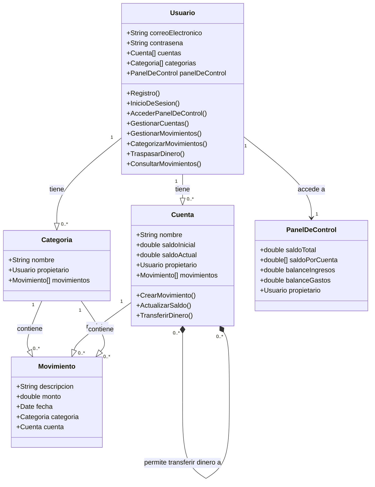

```mermaid
classDiagram
  class Usuario {
    +String correoElectronico
    +String contrasena
    +Cuenta[] cuentas
    +Categoria[] categorias
    +PanelDeControl panelDeControl
    +Registro()
    +InicioDeSesion()
    +AccederPanelDeControl()
    +GestionarCuentas()
    +GestionarMovimientos()
    +CategorizarMovimientos()
    +TraspasarDinero()
    +ConsultarMovimientos()
  }

  class Cuenta {
    +String nombre
    +double saldoInicial
    +double saldoActual
    +Usuario propietario
    +Movimiento[] movimientos
    +CrearMovimiento()
    +ActualizarSaldo()
    +TransferirDinero()
  }

  class Categoria {
    +String nombre
    +Usuario propietario
    +Movimiento[] movimientos
  }

  class Movimiento {
    +String descripcion
    +double monto
    +Date fecha
    +Categoria categoria
    +Cuenta cuenta
  }

  class PanelDeControl {
    +double saldoTotal
    +double[] saldoPorCuenta
    +double balanceIngresos
    +double balanceGastos
    +Usuario propietario
  }

  Usuario "1" --|> "0..*" Cuenta : tiene
  Usuario "1" --|> "0..*" Categoria : tiene
  Usuario "1" --> "1" PanelDeControl : accede a
  Categoria "1" --|> "0..*" Movimiento : contiene
  Cuenta "1" --|> "0..*" Movimiento : registra
  Categoria "1" --|> "0..*" Movimiento : contiene
  Cuenta "0..*" *--* "0..*" Cuenta : permite transferir dinero a
```
